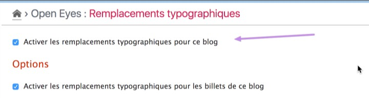
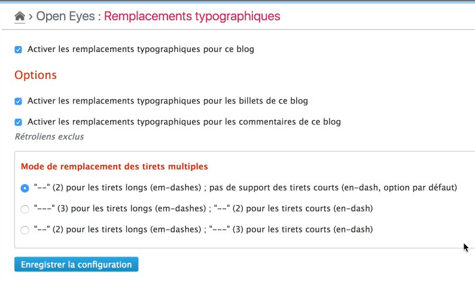

Settings
========

!!! note
	All settings done on the main page of the plugin is only related to the **current blog**

Activation
----------

The plugin **must** be activated before beeing used on **each** blog of the platform. This activation is done at the top of the setting page of the plugin (“Blog” menu → “Typographic replacements”).

Options
-------

By default the plugin process entries content (and excerpt). You can also activated this process for the comments (excluding trackbacks, pingbacks or webmentions):

You can also tune the process for the en/em dashes replacement to one of these options:

 * "\--" for em-dashes; no en-dash support (default)
 * "\-\--" for em-dashes; "\--" for en-dashes
 * "\--" for em-dashes; "\-\--" for en-dashes
